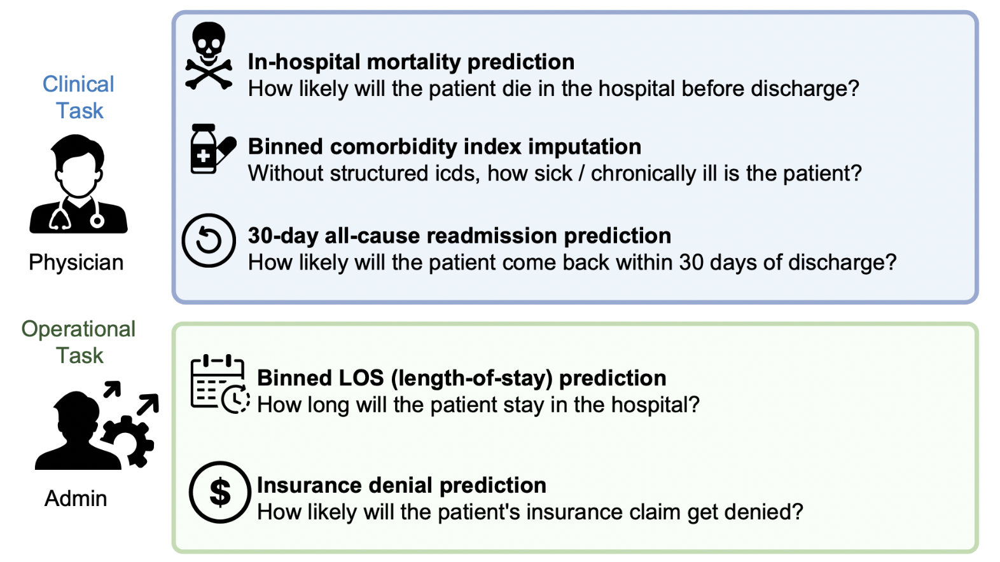

# Language Models Has the Potential to Improve Healthcare Quality By Reading Alongside Physicians

TL;DR: We trained a BERT (a language model) using 10 years of clinical notes from NYU Langone and silently deployed it to evaluate potential clinical impact. Our model outperforms structured baselines on 3 clinical tasks and 2 operational tasks, benefits from pretraining with clinical texts and increases generalizability to a different site through local finetuning. Our results show potential for using clinical language model in medicine to read alongside physicians and provide guidance at the point of care. See our [paper](https://www.nature.com/articles/s41586-023-06160-y) for more details.

---

Imagine being a doctor at an emergency room. Your patient Lisa is brought in by ambulance and rapidly deteriorating. As a physician, you are expected to make a series of timely, accurate, evidence-based clinical decisions to help Lisa: Should I focus on her now and let Tommy with stomachache wait because Lisa is more likely to die? Should I consider my diagnosis more carefully because Lisa has multiple complicated chronic diseases? Should I ask the admin to request additional beds because none of our current patients are likely to leave soon? Should I schedule a surgery for Lisa? Should I prescribe antibiotics? Which tests should I administer? Should I perform this procedure if the her insurance is unlikely to fully reimburse her? Now that she looks better, is it too early to discharge her?

There are many predictive models that you could use to help you make these decisions. However, it will require a substantial amount of work to find the data and calculate all of them for the ones that exist, and there will still be many questions. Will these work on my patients in this setting? How can I do this while still focusing on Lisa? What about my other patients?

One might wonder: could we build automated assistance tool to facilate making data driven medical decisions? Researchers have built clinical predictive models that forecasts adverse patient outcomes based on data, which helps doctors make decisions based on data-driven prognosis. These models are frequently derived from [rules](https://en.wikipedia.org/wiki/Clinical_prediction_rule) that existed for decades as well as from [machine learning methods](https://ieeexplore.ieee.org/document/9134853). For example, [LACE](https://www.mdcalc.com/calc/3805/lace-index-readmission) Index is a regression model for estimating whether a patient will be readmitted or die within 30 days based on 4 structured features: Length of stay, Acuity of admission, Comorbidity index, and number of ED visits in the past 6 months. If a patient stays long, had an acute admission (e.g., brought in by ambulance), has a high comorbidity index (i.e., many underlying chronic disease), and has numerous vists to emergency room, then the patient has a high chance of being readmitted or dying because they are very sick and has a complicated medical history. 

However, many clinical predictive models rely on structured data culled from Electronic Health Record (EHR) or direct physician [input](https://www.mdcalc.com/calc/3917/charlson-comorbidity-index-cci). This reliance on structured inputs introduces complexity in data processing, model development and deployment, which in part led to the overwhelming majority of medical predictive algorithms being trained, tested, and published, yet never deployed to assess their impact on real world clinical care. This is frequently referred to as the "[last mile problem](https://bmcmedicine.biomedcentral.com/articles/10.1186/s12916-019-1426-2)". For example, to get the "comorbidity index" feature for LACE, one needs to join multiple tables from the database and writes a script that converts disease code (e.g., 428.0) to a score (e.g., Congestive Heart Failure, +1). Fixing a set of structured features could also miss important personal details such as "the patient was domestically abused and has been homeless for 3 years."

Our insight for tackling the last mile problem comes from EHR notes, where physicians are trained to document their decision making process with all relevant clinical information. For example, below is a representative clinical note that contains a wealth of data (including some of LACE's features). **L**ength of stay can be inferred from the difference between discharge date and admit date. "Brought in by ambulance" indicates that the admissin is **a**cute. **C**omorbidity index can be inferred from the mention of chronic diseases (diabetes, AIDS). When a patient frequents **E**R, physiciansn also take notes of this anomaly (2 times in the past 3 months). The note also contains additional useful information such as the radiologist's reading of the MRI scan (white matter ischemic changes) and the prescribed medications.

> DISCHARGE NARRATIVE    
> **Admit date: March 20, 3000,  Expected Discharge date: March 23, 3000**    
> Admitting Physician: Bobcat MD      
> History of Present Illness:  Lisa is a 89 y.o. female **brought in by ambulance** with history of latent **diabetes**, TB s/p tx, NASH/cryptogenic Child Class B cirrhosis (MELD 12) listed liver tx, with recent EGD demonstrating non-bleeding grade 2 esophageal varices s/p TIPSs and variceal embolization who presents with worsening confusion and wandering in her home. Lisa has no immediate family and has asked the nursing home staff to bring her to ER **2 times** this past 3 months. …….  ER Temp 36.6-36.9 HR 66-75 SBP 105-113, 98% room air. Labs reviewed, compared to prior, improved AST/ALT, Ammonia 188 (previous 40s),  H/H 10.6/33.3 (baseline Hgb 8), Platelet 28 (baseline 40s), .... **MRI** brain showed white matter ischemic changes without acute infarct and no enhancement or susceptibility  associated with hyperdense bifrontal lesions of questionable etiology. The patient is stable for discharge home.  Past Medical History: Arthritis, Cervicalgia, Chronic prostatitis, Cirrhosis …… Medications: rifAXIMin 550 mg tablet  Commonly known as:  **XIFAXAN**   Take 1 tablet by mouth 2 (two) times daily. 

What's great about EHR notes is that we have effective tools to work with them. Recent advances in Natural Language Processing enable transformers (a type of language model) to efficiently learn useful representation from large amount of unlabelled texts. For example, [ChatGPT](https://chat.openai.com/auth/login) was trained on hundreds of billions of tokens from the internet and outputs human-like utterances. 

---

### Language Model Approach to Clinical Prediction

The fact that EHR notes document physician's decision making process, combined with the impactful performance of transformers on a wide range of tasks, motivates us to approach clinical prediction using language models. Specifically, our approach consists of 4 steps: data collection, pretraining, finetuning, and deployment. See our [paper](https://www.nature.com/articles/s41586-023-06160-y) for more details.

We evaluated our clinical predictor on 3 clinical tasks and 2 operational tasks. The clinical tasks help physicians make clinical decisions and the operational tasks help hospital admins reduce costs. **NYUTron is capable of being extended to these tasks**. NYUTron has an AUC of 78.7%-94.9%, with an improvement of 5.36%-14.7% AUC compared to traditional structured data based models.

For the full scientific investigation and all findings, please refer to our [paper](https://www.nature.com/articles/s41586-023-06160-y). Three major takeaway messages though:

**1. On small samples, NYUTron is competitive with a small group of physicians at predicting 30-day all-cause readmissions**. 

**2. A language model trained on unstructured clinical notes better scales with data compared to traditional structured models.** 

**3. Clinical language models shows generalizability to different sites through local finetuning**. 

## Discussion
In this blog post, we started by explaining how the "last mile problem" limits the impact of clinical predictive models in healthcare environments. Our insight to this problem is that the quality information in EHR notes enables us to leverage unsupervised pretraining with clinical texts and to integrate with the physician's note-writing workflow. While our initial findings are incredibly promising, we encourage future works to look into limitations such as confounding factors (race, age, department, time), fairness, and privacy. Furthermore, the ultimate validation of our approach must come from randomized controlled trials of interventions tied to individual task predictions to assess their clinical impact, and from user feedback as we continue to integrate NYUTron into health systems. 
